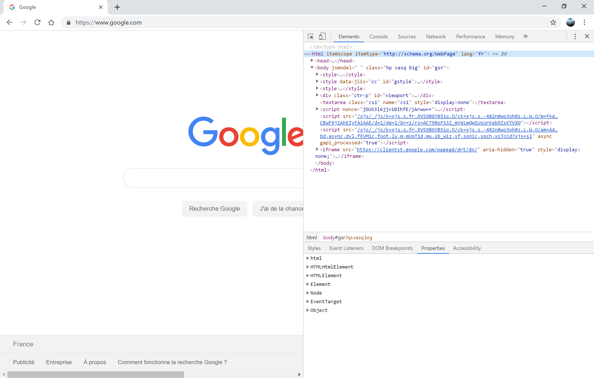
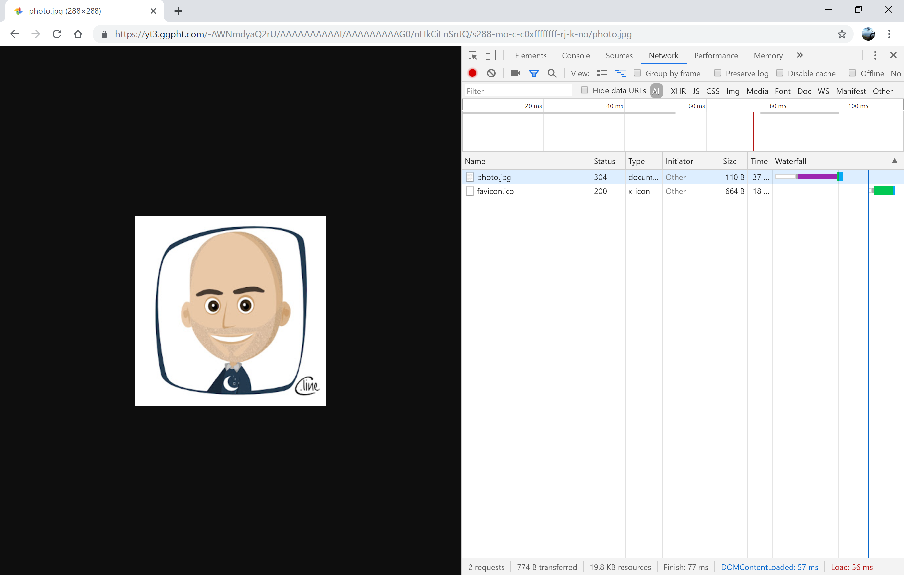
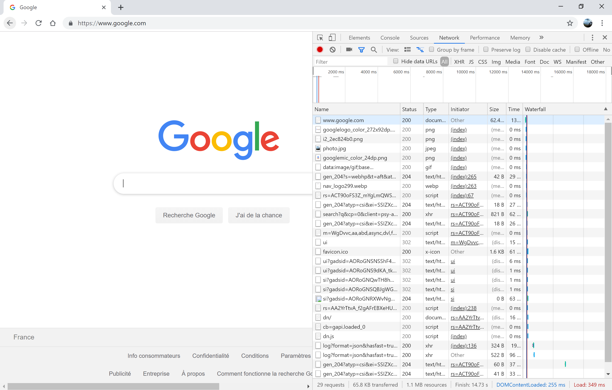

# Exercices

Pour réaliser des exercices je conseille l'utilisation d'un navigateur moderne.

Personnellement j'utilise Chrome mais n'importe quel autre est utilisable.

Un navigateur moderne possède des outils d'aide au développement. Ces outils sont très pratiques pour comprendre et apprendre le web.
Sur chrome, il suffit d'appuyer sur la touche F12 pour faire apparaître ces outils dans le navigateur (voir figure suivante)

## URL

### Robustesse du navigateur

Prenez une URL que vous connaissez et essayer de tester la robustesse de votre navigateur en saisissant seulement une partie de celle-ci.

Par exemple avec https://www.google.com
* http://www.google.com (pas le bon protocole)
* www.google.com (sans protocole)
* google.com (en ne mettant pas le début du nom)
* https://www.google.com/webhp
* https://www.google.com/search

### URL non conforme

Essayez des URL qui ne sont pas conformes et observez ce que dit le navigateur.
* google.com/index.html
* hhtttp:/ww.gogoooogle.com
* cours NSI 

## Ressources non HTML

Ouvrez une URL qui pointe vers une ressource non HTML et vérifiez que le navigateur envoie une seule requête pour récupérer la ressource.

Par exemple avec l'URL suivante:
* https://yt3.ggpht.com/-AWNmdyaQ2rU/AAAAAAAAAAI/AAAAAAAAAG0/nHkCiEnSnJQ/s288-mo-c-c0xffffffff-rj-k-no/photo.jpg
  

En utilisant les outils du développeur, vous pouvez vérifier qu'une requête est envoyée pour récupérer l'image (c.f. figuire suivante)

## Ressources HTML

Ouvrez une URL qui pointe vers une page HTML et observez que le navigateur envoie plusieurs requêtes pour obtenir toutes les ressources liées à la page HTML.

Par exemple avec l'URL suivante:
* www.google.com

Vous pouvez voir que le navigateur envoie une trentainte de requêtes.

## Interaction avec la page web

Intéragissez avec une page web et essayez de savoir si le navigateur envoie des requêtes. Si tel est le cas, est-ce qu'une nouvelle page est affichée ?

Par exemple avec l'URL suivante:
* www.google.com

Si vous commencez à écrire dans le champs textuel de la recherche, vous pouvez voir avec les outils du développeur que le navigateur envoie des données mais qu'il n'affiche pas une nouvelle page.

Par contre, quand vous validez la recherche une nouvelle page est reçue et affichée (celle-ci contient la réponse à votre recherche)