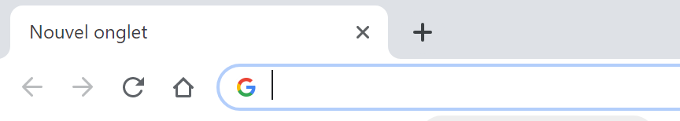

# Fonctionnement d'un site web de bout en bout

L'objectif est ici de montrer qu'un site web est constitué de plusieurs ressources (pages HTML, feuilles de style CSS, scripts JavaScript, images, vidéo, son).
Ces ressources sont gérées par le serveur web qui les rend accessibles via le protocole HTTP.
Un utilisateur utilise son navigateur et interagit avec celui-ci. Le navigateur présente (affiche) les ressources à l'utilisateur. Selon les interactions réalisées par l'utilisateur, le navigateur interagit avec le serveur pour accéder à de nouvelles ressources et les afficher.

## Au commencement il y a l'URL

(cette section n'apparatient pas au programme mais il me semble intéressant de la présenter ici)

Après avoir démarré son navigateur, la première chose qu'un utilisateur fait pour accéder à un site web et de **saisir l'URL du site**.

L'URL d'un site c'est ce que l'on écrit dans la barre de navigation du navigateur (figure suivante)

Voici quelques exemples de navigation que vous pouvez utiliser:
* http://www.google.com
* http://www.youtube.com
* https://www.education.gouv.fr/cid138218/au-bo-special-du-22-janvier-2019-programmes-d-enseignement-du-lycee-general-et-technologique.html

Une URL est composée au moins de 2 parties :
* Le protocole (http://)
* Le nom du serveur web (www.education.gouv.fr)

Les navigateurs web sont relativement souples car, si vous ne saisissez pas le protocole, ils le font pour vous.

Certaines URL contiennent une troisième partie :
* Le nom de la ressources  (cid138218/au-bo-special-du-22-janvier-2019-programmes-d-enseignement-du-lycee-general-et-technologique.html)

