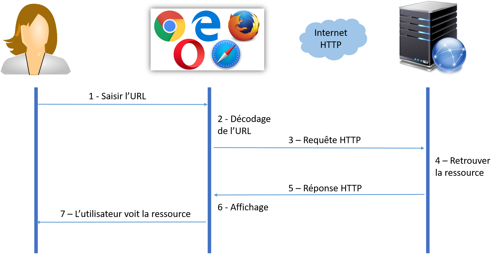
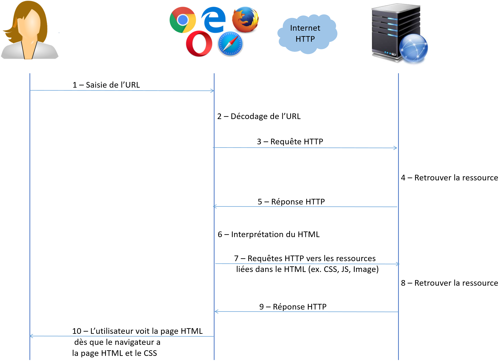
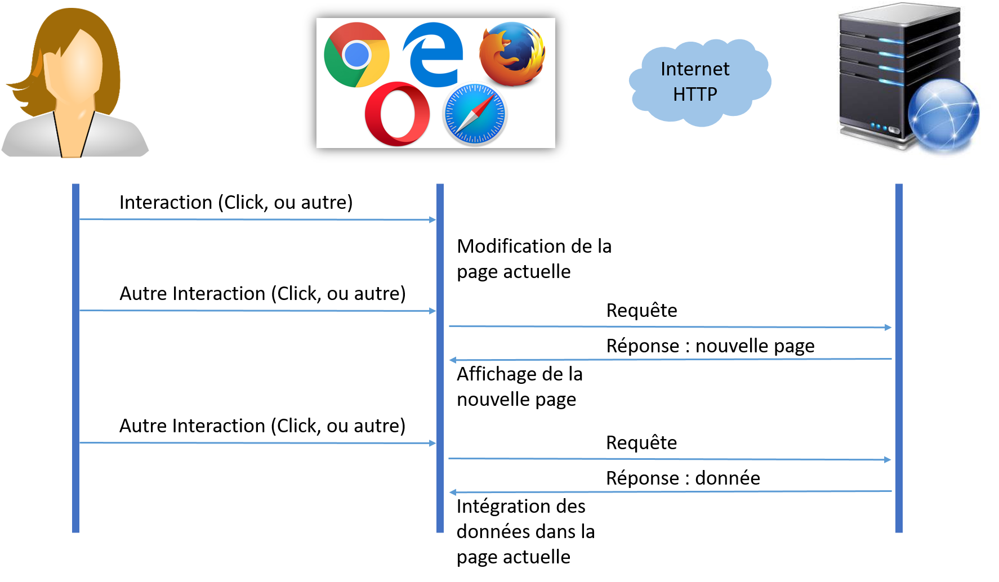

# Fonctionnement d'un site web de bout en bout

L'objectif est ici de montrer qu'un site web est constitué de plusieurs ressources : pages HTML, feuilles de style CSS, scripts JavaScript, images, vidéo, son, etc.
Ces ressources sont gérées par le serveur web qui les rend accessibles via le protocole HTTP.
Un utilisateur utilise son navigateur et interagit avec celui-ci. Le navigateur présente (affiche) les ressources à l'utilisateur. Selon les interactions réalisées par l'utilisateur, le navigateur interagit avec le serveur pour accéder à de nouvelles ressources et les afficher.

[Exercices](EXERCICES.md)

## Au commencement il y a l'URL

(cette section n'appartient pas au programme mais il me semble intéressant de la présenter ici)

Après avoir démarré son navigateur, la première chose qu'un utilisateur fait pour accéder à un site web est de **saisir l'URL du site**.

L'URL d'un site c'est ce que l'on écrit dans la barre de navigation du navigateur (figure suivante)

Voici quelques exemples d'URL que vous pouvez utiliser:
* http://www.google.com
* http://www.youtube.com
* https://www.education.gouv.fr/cid138218/au-bo-special-du-22-janvier-2019-programmes-d-enseignement-du-lycee-general-et-technologique.html

Une URL c'est une chaîne de caractères. Elle est composée de 4 parties :
* Le **protocole** (http://) ou (https://)
* Le **nom du serveur web** (par exemple www.education.gouv.fr) ou son **adresse IP** (voir cours de réseau)
* Le **numéro du port** du serveur (par défaut 80)
* Le **nom de la ressource**  à afficher (par exemple /cid138218/au-bo-special-du-22-janvier-2019-programmes-d-enseignement-du-lycee-general-et-technologique.html)

### Le Protocole

Sur le web, seuls les protocoles HTTP et HTTPS sont utilisés. Ces protocoles sont standards. Ils précisent comment sont réalisés les échanges entre un navigateur et un serveur web. HTTPS est la version sécurisée de HTTP.

Les navigateurs web sont relativement souples quant à la saisie de l'URL:

Si vous ne saisissez pas le protocole, ils le font pour vous.
Par exemple, si vous saisissez (www.google.com) dans la barre de navigation et non pas (https://www.google.com), votre navigateur comprendra que le protocole est HTTPS.

### Le nom du serveur

Un serveur web est tout le temps connecté à internet. Il a donc une adresse IP (cette notion est présentée dans le cours réseau)qui est, en principe, tout le temps accessible.

Pour accéder facilement à un serveur web et ne pas avoir à retenir son adresse IP, les serveur web ont aussi un nom. C'est le système DNS (Domain Naming Service) qui fait le lien entre une adress IP et le nom des serveurs. Par exemple l'adresse IP de google est 216.58.209.228.

### Le numéro de port du serveur

Il est rare de voir un numéro de port dans une URL (essentiellement en mode programmation en local). Cela permet de préciser le numéro du port sur lequel s'exécute le serveur web. Par défaut, ce numéro est le **80**.

Dans nos exercice de développement nous utilisons un serveur local avec 3000 comme numéro de port. Son URL est donc `http://localhost:3000/index.html`.

### Le nom de la ressource

Les serveurs web disposent tous d'une **ressource par défaut**.
Si vous saisissez uniquement le protocole et le nom du serveur, c'est cette ressource par défaut que vous demandez (souvent c'est la page principale du site web - index.html).

### A retenir

Une URL identifie :
* un protocole
* un serveur web
* un port du serveur web (rare, sinon c'est le port 80 qui est utilisé par défaut)
* une ressource du serveur web (sinon c'est la ressource par défaut qui sera accédée)

Lorsqu'on saisie une URL dans la barre de navigation du navigateur, on demande au navigateur d'afficher la ressource ciblée (celle par défaut si aucun nom de ressource n'est précisé).

Les navigateurs récents sont même directement liés à un moteur de recherche (Google, Bing, etc.). Si vous tapez une chaîne de caractères longue ou qui est vraiment différente d'une URL dans la barre de navigation, ils considèrent que vous avez tapé une question et ils vous présentent la réponse émise par le moteur de recherche.

## Chargement d'une ressource

Saisir une URL dans la barre de navigation pour accéder à une ressource est une interaction entre l'utilisateur et le navigateur web.

Une fois cette saisie réalisée, le navigateur va alors décoder l'URL afin d'envoyer une requête HTTP vers le serveur.

Le serveur web va alors recevoir cette requête et y répondre en envoyant la ressource correspondante à l'URL.

Dès qu'il aura reçu la réponse, le navigateur va alors afficher la ressource afin que l'utilisateur puisse la voir.

La figure suivante présente cette suite d'intéractions :

La figure illustre le rôle joué par le navigateur. Il gère les interactions avec l'utilisateur et les traduit en échanges de messages (via HTTP ou HTTPS) avec le serveur.

Le serveur gère les ressources et les communique au navigateur.

Enfin, le navigateur est responsable de l'affichage des ressources reçues.

Si les ressources sont des images ou des vidéo, le navigateur se contente de les afficher.

Si les ressources sont des fichiers texte, le navigateur affiche le texte.

Si les ressources sont des fichiers binaires (fichier .zip ou autre), le navigateur propose de les sauvegarder sur le disque du votre ordinateur.

### A retenir

Un navigateur web permet d'afficher des ressources qui sont gérées par un serveur web.

L'utilisateur interagit avec le navigateur qui lui communique avec le serveur via le protocole HTTP ou HTTPS.

## Chargement d'une ressource HTML

Si le navigateur reçoit une page HTML, alors il va l'interpréter pour l'afficher.
Cela veut dire qu'il va récupérer toutes les autres ressources liées à la page (feuille de style CSS, images, vidéo, script JavaScript). Pour ce faire, il va envoyer plusieurs requêtes au serveur et mettre à jour l'affichage.

Pour être plus précis le navigateur réalise plusieurs choses en parallèle. Il fera un premier affichage dès qu'il aura reçu la page HTML et les feuilles de styles CSS liées. En parallèle, il enverra les requêtes pour récupérer les autres éléments liées à la page et fera des mises à jours de l'affichage lorsqu'il les recevra.

La figure suivante montre les intéractions réalisées pour afficher une page HTML. On voit que le navigateur effectue plusieurs requêtes HTTP.

### A retenir

Pour afficher une page HTML, le navigateur va émettre plusieurs requêtes avec le serveur web. Ces requêtes lui permettront d'obtenir toutes les ressources liées à la page HTML (style CSS, image, vidéo, script, etc.).

L'affichage d'une page HTML commence même si le navigateur n'a pas encore téléchargé l'intégralité de la page.
Néanmoins, il a besoin de l'intégralité des feuilles de style CSS pour commencer son affichage.

## Interaction avec une page HTML chargée

Une fois que l'utilisateur a demandé l'affichage d'une page HTML et que celle-ci a été chargée et affichée par le navigateur, il peut interagir avec celle-ci (cliquer, saisir du texte, etc.).

Ces interactions sont gérées par le navigateur. Plus précisément, pour chaque interaction le navigateur émet un **Event JavaScript** qui peut être capturé et donner l'exécution d'un traintement (codé en JavaScript).

Différents traitements peuvent être exécutés en réponse à un évènement d'intéraction.
* envoyer une requête vers le serveur pour demander l'affichage d'une nouvelle page HTML
* envoyer une requête vers le serveur et demander des informations qui seront intégrées à la page actuelle
* changer la page HTML sans même envoyer de requête vers le serveur (faire apparaître un éléments caché, lire une vidéo ou une chanson, etc.)

La figure suivante montre les 3 traitements qui peuvent être exécutés en réponse à un évènement d'intéraction. On considère que l'utilisateur a déjà chargé la page HTML avec laquelle il interagit.

### A retenir

Les interactions de l'utilisateur sont gérées par le navigateur. Pour chaque interaction un évènement est créé. Celui peut donner l'exécution d'un traitement (codé en JavaScript).

Les traitements associés aux interactions peuvent être de différents types (demander au serveur une nouvelle page et l'afficher, demander au serveur des nouvelles données et les intégrer à la page, effectuer des modifications de la page sans réaliser de communication avec le serveur, etc.)

Les traitements réalisés par le navigateur web sont asynchrone. C'est à dire que le navigateur les réalise dans l'ordre qu'il veut et quand il a le temps.