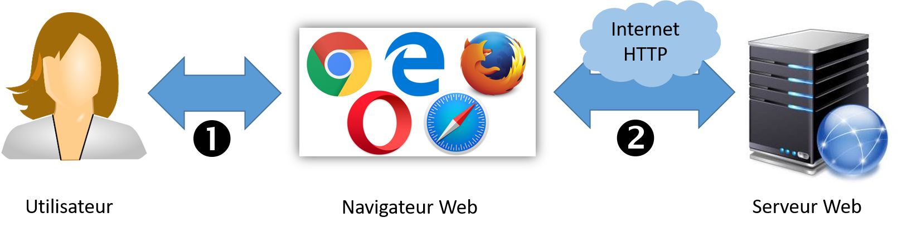

# Numérique et Sciences Informatiques (Web)

Programme de 1ère - Interactions entre l’homme et la machine sur le Web

Ce cours est fortement inspiré du [cours que nous avons donné à l'Université de Bordeaux](https://moodle1.u-bordeaux.fr/course/view.php?id=4719)

## Analyse du programme

Ma lecture personnelle est que le programme met l'emphase sur deux points :
1. Les interactions entre l'utilisateur et le navigateur web. Il s'agit de comprendre comment l'utilisateur interagit avec un site web (essentiellement en cliquant sur les éléments du site web) et de savoir comment ces interactions se traduisent dans le code en évennements JavaScript.
2. Les interactions entre le navigateur web et le serveur web. Il s'agit de comprendre que le navigateur interagit avec le serveur web grâce au protocole HTTP. Il émet des requêtes et recoit des réponses. L'objectif est de savoir comment coder l'emission et la reception de ces messages, du côté du serveur comme du côté du client.

Enfin le programme apporte une importance particulière aux formulaires web. Ceux-ci permettent à l'utlisateur de saisir des informations qui seront véhiculées jusqu'au serveur. Le seveur pourra alors effectuer des traitements paramétrés par ces informations.

La figure suivante illustre les deux points du programme. On voit (1) les interactions entre l'utilisateur et le navigateur web et (2) les interactions entre le navigateur web et le serveur web.
Le cas particulier des formulaires web permet de montrer les interactions de bout en bout.

## Séquence pédagogique

Pour couvrir le programme voici la séquence que je propose: 

1. [Fonctionnement d'un site web de bout en bout](./1-E2E/README.md)
2. [HTML ou comment structurer l'information contenue dans un site web](./2-HTML/README.md)
3. Interaction Utilisateur / Navigateur Web, exploitation de JavaScript (DOM et Event)
4. Interaction Navigateur Web / Serveur Web, comment le client interagit avec le serveur ?

Pour aller plus loin, on pourra traiter des points suivants:
* Le style des pages web avec CSS
* Préservation de la vie privée sur le web : les cookie
* Authentification et confidentialité sur le web : HTTPS et autres mécanismes

## Rappel du programme

Le programme précise les contenus suivants:

| Contenus | Capacités Attendues | Commentaires |
|----------|---------------------| ------|
| 
Modalités de l’interaction entre l’homme et la machine
 
Événements
 | 
Identifier les différents composants graphiques permettant d’interagir avec une application Web.
 
Identifier les événements que les fonctions associées aux différents composants graphiques sont capables de traiter.
| Il s’agit d’examiner le code HTML d’une page comprenant des composants graphiques et de distinguer ce qui relève de la description des composants graphiques en HTML de leur comportement (réaction aux événements) programmé par exemple en JavaScript.|
| 
Interaction client-serveur.
 
Requêtes HTTP, réponses du serveur
| 
Distinguer ce qui est exécuté sur le client ou sur le serveur et dans quel ordre.

Distinguer ce qui est mémorisé dans le client et retransmis au serveur.
 
Reconnaître quand et pourquoi la transmission est chiffrée.
 | 
Il s’agit de faire le lien avec ce qui a été vu en classe de seconde et d’expliquer comment on peut passer des paramètres à un site grâce au protocole HTTP.
|
|
Formulaire d’une page Web
 | 
Analyser le fonctionnement d’un formulaire simple.

Distinguer les transmissions de paramètres par les requêtes POST ou GET.
| 
Discuter les deux types de requêtes selon le type des valeurs à transmettre et/ou leur confidentialité.

